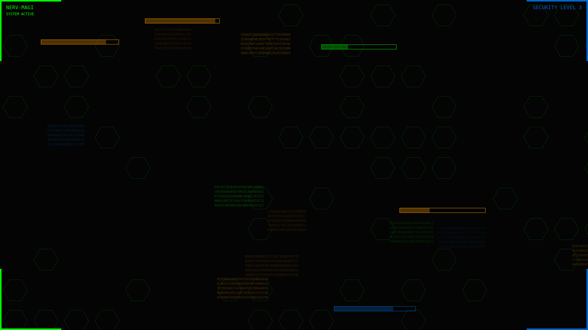

# Evangelion-themed Mafia Game

A web application for playing the Mafia card game with an Evangelion-inspired HUD design. This project combines the classic social deduction game with the visual aesthetic of Neon Genesis Evangelion's user interfaces.



## Project Description

This web application allows players to:
- Create and join game rooms
- Play the Mafia card game with friends
- Experience an immersive Evangelion-inspired interface
- Communicate in real-time during game phases
- Enjoy role-based gameplay with civilians, mafia, and detectives

The visual design draws inspiration from NERV's computer systems in Neon Genesis Evangelion, featuring angular UI elements, neon colors, and HUD-like displays.

## Setup Instructions

### Prerequisites
- Modern web browser (Chrome, Firefox, Safari, Edge)
- Internet connection for Firebase functionality

### Local Development Setup
1. Clone the repository:
   ```
   git clone https://github.com/yourusername/mafia-evangelion.git
   cd mafia-evangelion
   ```

2. Set up Firebase:
   - Create a Firebase project at [firebase.google.com](https://firebase.google.com)
   - Enable Google Authentication in the Firebase Console
   - Create a Firestore database
   - Update the `firebaseConfig` object in `js/firebase.js` with your project credentials
   - Deploy the security rules from `firebase.rules.json` to your Firebase project

3. Serve the files using a local web server:
   - You can use Python's built-in server:
     ```
     python -m http.server
     ```
   - Or use any other local development server

4. Open your browser and navigate to `http://localhost:8000`

### Deployment
1. Build and optimize the project (if using build tools)
2. Deploy to your preferred hosting service:
   - Firebase Hosting
   - GitHub Pages
   - Netlify
   - Vercel
   - Any static web hosting service

## How to Play

### Game Setup
1. Enter your Agent ID (username)
2. Create a new operation (room) or join an existing one with an operation code
3. Wait for all players to join
4. The room creator configures the number of mafia and detective agents
5. Start the game to receive your role assignment

### Roles
- **Civilian**: Work with other civilians to identify and eliminate the mafia
- **Mafia**: Eliminate civilians without being detected
- **Detective**: Investigate players to determine their allegiance

### Game Phases
1. **Day Phase**: All players discuss and vote on who to eliminate
2. **Voting Phase**: Players cast votes to eliminate a suspected mafia member
3. **Night Phase**: 
   - Mafia members select a civilian to eliminate
   - Detectives investigate a player to learn their role

### Winning Conditions
- **Civilians Win**: When all mafia members are eliminated
- **Mafia Wins**: When the number of mafia equals or exceeds the number of civilians

## Technologies Used

- **HTML5**: Semantic structure and content
- **CSS3**: Styling with Evangelion-inspired design elements
- **JavaScript**: Game logic and UI interactions
- **Firebase**: 
  - Authentication for user management
  - Firestore for real-time database functionality
  - Security rules for access control
- **ES6 Modules**: For modular code organization

## Firebase Integration

The application uses Firebase Web SDK v9 (modular approach) for authentication and real-time database functionality:

### Authentication System
- Google Sign-In functionality
- User state management
- Profile data handling

### Room Management System
- Room creation with unique join codes
- Room joining functionality
- Real-time synchronization of room data
- Game state management

### Security Rules
- Authentication requirements for all operations
- Data validation for room and player structures
- Access control based on player membership in rooms

## Project Structure

```
mafia-evangelion/
├── css/                     # Stylesheets
│   ├── main.css             # Main styling
│   └── eva-theme.css        # Evangelion-specific styling
├── js/                      # JavaScript files
│   ├── app.js               # Main application logic
│   ├── game.js              # Game mechanics
│   ├── firebase.js          # Firebase configuration and interactions
│   ├── auth.js              # Authentication methods
│   └── ui.js                # UI interactions
├── assets/                  # Visual assets
│   ├── images/              # Background images, logos
│   ├── fonts/               # Custom fonts
│   └── cards/               # Card designs
├── firebase.rules.json      # Security rules for Firebase
└── index.html               # Main HTML file
```

## Credits

- Inspired by Neon Genesis Evangelion created by Hideaki Anno
- Mafia game concept based on the classic social deduction party game
- Fonts: Roboto and Montserrat from Google Fonts

## License

This project is released under the MIT License. See the LICENSE file for details.